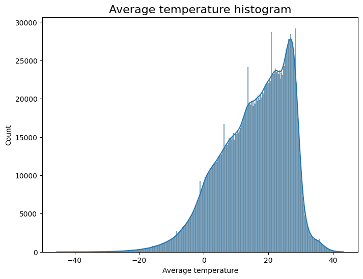
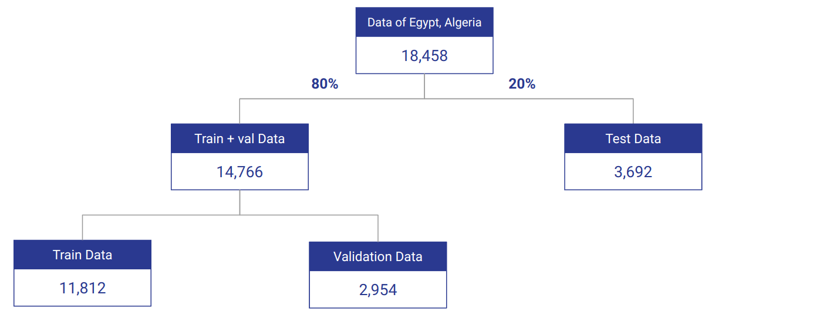

# QEarth: Quantum & AI for Climate

## **Table of Contents**

1. [Introduction](#introduction)
2. [Why Predict Climate Temperature?](#why-predict-climate-temperature)
3. [Role of AI in Climate Prediction](#role-of-ai-in-climate-prediction)
4. [Quantum Computing for Enhanced Predictions](#quantum-computing-for-enhanced-predictions)
5. [Data](#data)
6. [Preprocessing](#preprocessing)
7. [Models](#models)
    - [Baseline Model: LSTM](#baseline-model-lstm)
    - [Support Vector Machines (SVM)](#support-vector-machines-svm)
    - [Quantum Support Vector Machines (QSVM)](#quantum-support-vector-machines-qsvm)
8. [Results](#results)
9. [Mobile Application](#mobile-applicatation)
10. [Future Work](#future-work)
11. [Installation](#installation)
12. [Usage](#usage)

## **Introduction**

The QEarth project aims to advance climate forecasting by integrating quantum computing and AI techniques. We utilized
various models to predict daily temperatures and explored quantum-enhanced methods to improve accuracy. This README
provides a detailed overview of the project's steps, methodologies, and results.

## **Why Predict Climate Temperature?**

Accurate climate temperature predictions are crucial for several reasons:

1. **Impact on Human Health and Safety:**
    - Extreme temperatures can lead to health issues such as heat strokes or hypothermia. Accurate predictions help in
      preparing for and mitigating these risks, ensuring public safety.

2. **Agricultural Planning:**
    - Farmers rely on weather forecasts to make informed decisions about planting and harvesting. Reliable temperature
      predictions can enhance agricultural productivity and food security.

3. **Disaster Preparedness:**
    - Understanding temperature trends can help in predicting and preparing for natural disasters such as heatwaves and
      cold spells, reducing their impact on communities.

4. **Economic Implications:**
    - Temperature anomalies can affect energy demand, transportation, and other economic activities. Precise predictions
      can lead to more efficient resource management and cost savings.

5. **Environmental Monitoring:**
    - Monitoring temperature changes over time is crucial for studying climate change and its impact on ecosystems.
      Early detection of trends helps in addressing environmental challenges.

## **Role of AI in Climate Prediction**

Artificial Intelligence (AI) plays a transformative role in climate prediction:

- **Data Handling:** AI algorithms can process vast amounts of climate data efficiently, identifying patterns and trends
  that are not easily visible through traditional methods.
- **Model Accuracy:** Machine learning models, such as LSTM and SVM, can capture complex relationships in climate data,
  leading to more accurate forecasts.
- **Real-Time Analysis:** AI can provide real-time temperature predictions, allowing for timely responses to
  weather-related events.

## **Quantum Computing for Enhanced Predictions**

Quantum Computing (QC) offers potential advantages for climate modeling:

- **Increased Computational Power:** QC can handle complex simulations and optimizations that are challenging for
  classical computers, potentially leading to more accurate and detailed climate models.
- **Advanced Algorithms:** Quantum algorithms may offer improvements over classical algorithms in solving optimization
  problems, which can enhance forecasting accuracy.
- **Efficient Data Processing:** QC could process large datasets more efficiently, leading to faster and more accurate
  predictions.

## **Data**

- **Dataset:
  ** [Daily Temperature of Major Cities](https://www.kaggle.com/datasets/sudalairajkumar/daily-temperature-of-major-cities)
- **Description:** The dataset includes daily temperature records for major cities worldwide, featuring columns such as
  date, city, country, and temperature.
- **Features:**
    - Date (year, month, day)
    - Region
    - State
    - City
    - Country
    - Average Temperature
- **Size:** 2,906,327 rows × 8 columns

## **Preprocessing**

1. **Data Cleaning:**
    - Removed any missing or invalid values, resulting in the removal of **79,672** entries.
    - Removed unneeded columns, resulting in the removal of 1 column.
    - Converted temperature units from Fahrenheit to Celsius.

2. **Feature Engineering:**
    - **Date Features:** Extracted year, month, and day from the date column.
    - **One-Hot Encoding:** Applied one-hot encoding to categorical columns (city, country, month, day, year) to convert
      them into numerical features.
    - **Normalization:** Scaled temperature values for better model performance.
    - **Linear Regression Representation:**
        - Analyzed trends using linear regression graphs.

## **Data Analysis**

1. **Distribution of Data Entries per Average Temperature Values**
   

2. **Distribution of Data Entries Count per Regions**

   

3. **Average Temperature per Year**
   

4. **Linear Regression Graph**
   
    - The graph shows different average temperature levels across continents with an increasing trend over the years.

5. **Histograms of Average Temperature by Country**
   

## **Data Splitting**

- **Selected Data:** Limited to Egypt and Algeria for manageable size and relevance.
- **Data Size:** 18,458 entries.
- **Splitting Ratio:**
    - Train: 8,812
    - Validation: 2,954
    - Test: 3,692
      

## **Models**

### **Baseline Model: LSTM**

[LSTM SOURCE CODE](./../models/womanium-climate-ai-LSTM.ipynb)

- **Model Description:** Long Short-Term Memory (LSTM) network designed to capture temporal dependencies in temperature
  data.
- **Implementation:** Built and trained using historical temperature data.
- **Results:**
    - R²: 0.871
    - MAE: 1.678
    - MSE: 5.182
    - RMSE: 2.276

### **Support Vector Machines (SVM)**

[SVM SOURCE CODE](./../models/womanium-climate-ai-SVM.ipynb)

- **Model Description:** Support Vector Regression (SVR) to predict temperature values.
- **Implementation:** Applied SVR to the preprocessed data.
- **Results:** Achieved slightly higher accuracy compared to LSTM.

### **Quantum Support Vector Machines (QSVM)**

[QSVM SOURCE CODE](./../models/womanium-climate-ai-QSVM.ipynb)

- **Model Description:** Quantum Support Vector Regression (QSVR) applied using quantum simulators.
- **Results:**
    - **IBM Osaka:** Accuracy: 0.932
    - **IBM Sherbrooke:** Accuracy: 0.929
    - **IBM Brisbane:** Accuracy: 0.935
- **Note:** Achieved results comparable to classical SVR due to limitations in simulation and hardware access.

### **Dimensionality Reduction**

To facilitate running QSVR, Principal Component Analysis (PCA) was performed to reduce the dimensions of features to 10.
This reduction helped in managing computational complexity and optimizing model performance.

## **Results**

- **LSTM:** Matched previous studies with robust temperature predictions.
- **SVM:** Slight improvements over LSTM, highlighting its efficacy.
- **QSVM:** Demonstrated potential but limited by simulation and hardware constraints.

## **Mobile Application**
- Our model will be offered as an API that will provide long-term, real-time, location-specific weather predictions, enabling integration with websites and mobile devices.
- We developed the frontend using **Flutter**

- **Starting window**


- **Main Page**


- **Information page**


## **Future Work**

- **Quantum Hardware Access:** Seek opportunities for testing models on real quantum hardware.
- **Extended Models:** Explore advanced quantum algorithms and hybrid models.
- **Scalability:** Investigate methods for handling larger datasets and complex features.

## **Installation**

Clone Repository:

```bash
git clone https://github.com/your-repo/QEarth.git
```

## **Usage**

### Train Models:

**LSTM**

```bash
python models/womanium-climate-ai-LSTM.ipynb
```

**SVR**

```bash
python models/womanium-climate-ai-SVM.ipynb
```

**QSVR**

```bash
python models/womanium-climate-ai-QSVM.ipynb
```

---

## **Acknowledgments**

We would like to extend our sincere thanks to the Womanium Quantum+AI program for their support and funding. Their
resources and guidance have been invaluable in advancing our project and exploring the potential of quantum computing
and AI in climate forecasting.

---
